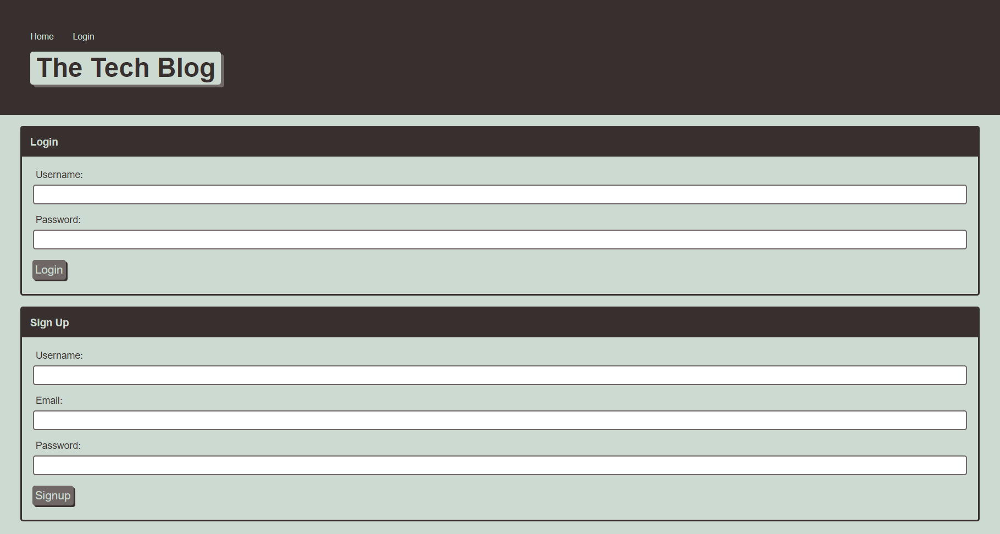

# tech-blog

## Description
This application provides the user with the ability to login, view posts, add comments, add posts, edit and delete existing posts that they created, and to log out.

## Deployed Application
[Deployed Tech-Blog Application](https://cryptic-sands-31802.herokuapp.com/)

## Tech Blog GitHub Repo
[GitHub Repo for Tech-Blog](https://github.com/catse2000/tech-blog)

## User Story

## Acceptance Criteria

## Application Screenshots

### Home Page

### Login Page

### Comment Page

### Dashboard Page
